<p align="center">
  
</p>

<h1 align="center">
  
  Snowball Device · M5Stack — Preview
</h1>

<p align="center"><strong>오리지널 ESP32 Core + FACES 키보드 펌웨어 및 기기 게이트웨이</strong></p>

<p align="center">
  <a href="README.md">English</a> | <a href="README.ko.md">한국어</a>
</p>

<p align="center">
  <a href="LICENSE"></a>
  
  
  <a href="https://github.com/fkiller/Snowball_Middleware#one-shot-install"></a>
</p>

---

<a id="one-shot-install"></a>
## Snowball 한 번에 설치

**Snowball Middleware가 공통 설치와 PC 실행을 담당합니다.** Snowball Control은 MK20 펌웨어·HUD·기기 도구를, Snowball Device · M5Stack은 ESP32 펌웨어와 게이트웨이를 담당합니다. Web UI와 M5Stack에는 Control 체크아웃이 필요 없습니다. 세 Snowball Harness 저장소의 Codex·Antigravity·OpenCode 플러그인은 모든 프로필에 함께 설치됩니다.

Windows PowerShell에서 원하는 구성의 명령 **하나만** 실행하세요.

| 내 구성 | 함께 설치하는 구성 요소 | 명령 |
| --- | --- | --- |
| MK20 | MK20 런타임 + Middleware + 하네스 플러그인 3종 | `& ([scriptblock]::Create((irm 'https://raw.githubusercontent.com/fkiller/Snowball_Middleware/main/install.ps1'))) -Profile mk20` |
| M5Stack + FACES | M5Stack 펌웨어/게이트웨이 + Middleware + 하네스 플러그인 3종 | `& ([scriptblock]::Create((irm 'https://raw.githubusercontent.com/fkiller/Snowball_Middleware/main/install.ps1'))) -Profile m5stack` |
| Web UI만 | Middleware + 하네스 플러그인 3종 | `& ([scriptblock]::Create((irm 'https://raw.githubusercontent.com/fkiller/Snowball_Middleware/main/install.ps1'))) -Profile web` |

설치기는 Node/Git(기기 프로필은 Python 포함) 준비, 저장소 빌드, 격리된 플러그인 프로세스의 실제 초기화 검증, **Start-Snowball.ps1** 실행 파일·바탕화면 바로가기 생성까지 수행합니다. 실제 API 응답을 확인한 뒤 **http://127.0.0.1:8765/**를 엽니다. 기본 설치 위치는 `%LOCALAPPDATA%\Snowball`이며, 이후 실행 파일은 다운로드 없이 설치된 구성을 다시 시작합니다.

M5Stack은 첫 설치 시 USB로 연결하세요. 플래시 용량 탐지, 기존 전체 플래시 비공개 백업, 펌웨어 업로드, 실제 FACES 응답 확인 후 등록합니다. MK20은 같은 사설 LAN에 연결하세요. ADB 탐지 또는 SD/Wi-Fi 초기 설정과 물리 QMK DFU 단계를 설치기에서 안내합니다. MK20 변경 전 전체 SD 디스크 이미지 백업을 보관해야 합니다. USB 재연결·부트로더 진입·네이티브 하네스 로그인은 사용자가 수행해야 하며, 네이티브 앱이 없으면 해당 공급자는 사용 불가로 표시합니다.

옵션: `-InstallRoot 경로`, `-Serial COM번호`, `-Bind PC의_사설_IP`, `-Mk20Address 기기_IP:5555`, `-Port 8765`, `-NoStart`, `-NoFlash`(이미 설치된 펌웨어 확인). 여러 USB 포트나 LAN 어댑터가 있으면 해당 옵션으로 지정하세요. 오류가 나면 완료로 처리하지 않습니다. 원샷 부트스트랩은 현재 **Windows** 대상입니다. Node/Git가 설치된 macOS 개발 환경에서는 같은 부모 폴더의 체크아웃 구성으로 `npm run setup -- --profile web` 또는 `--profile m5stack`을 사용할 수 있습니다. Linux 전체 플러그인 런타임은 아직 지원하지 않습니다.

[공통 아키텍처와 저장소 역할](https://github.com/fkiller/Snowball_Control/blob/main/docs/ARCHITECTURE.md)

[Control · MK20](https://github.com/fkiller/Snowball_Control) · [Middleware · Installer / Web UI](https://github.com/fkiller/Snowball_Middleware) · [Device · M5Stack](https://github.com/fkiller/Snowball_Device_M5Stack) · Harness: [Codex](https://github.com/fkiller/Snowball_Harness_Codex), [Antigravity](https://github.com/fkiller/Snowball_Harness_Antigravity), [OpenCode](https://github.com/fkiller/Snowball_Harness_OpenCode)

---

오리지널 M5Stack Core / Gray와 FACES QWERTY용 네이티브 ESP32 펌웨어 및 Snowball Protocol 1 디바이스 플러그인입니다. 첫 버전은 영문과 한글 두벌식 키보드 입력을 지원하며, 음성을 녹음하거나 PC 마이크를 사용하지 않습니다.

## 실기 구동 영상

실제 M5Stack + FACES에서 세션 내용을 탐색하고, 표시 언어를 바꾸고, 키보드로 프롬프트를 작성하는 모습입니다. 사용자가 2026-10-04에 공개한 실기 영상 원본입니다.

<p align="center">
  <a href="assets/videos/m5stack_navigation_demo.mp4"></a><br>
  <em>24초 발췌 미리보기 · 전체 영상 1분 34초</em><br>
  <a href="assets/videos/m5stack_navigation_demo.mp4">▶ GitHub 전체 MP4</a> &nbsp;|&nbsp; <a href="https://x.com/fkiller/status/2106892916149158101?s=20">X 원본 글</a>
</p>

## 기기와 실제 구동 화면

<a href="https://docs.m5stack.com/en/core/Faces_Kit"></a>

제품 사진은 © M5Stack의 [공식 FACES Kit 문서](https://docs.m5stack.com/en/core/Faces_Kit)에서 제공하는 하드웨어 참고 사진입니다. 아래 이미지는 실제 연결된 기기의 펌웨어 화면입니다.

| 설정 | 표시 언어 | 입력 설정 |
| --- | --- | --- |
| 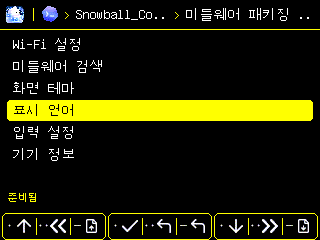 | 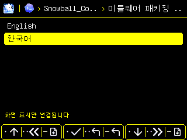 | 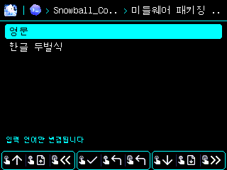 |

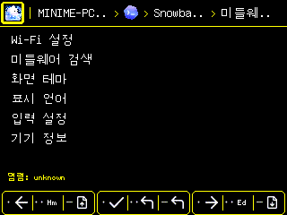

| 영문 입력 | 한글 입력 | 접속 상태 |
| --- | --- | --- |
| 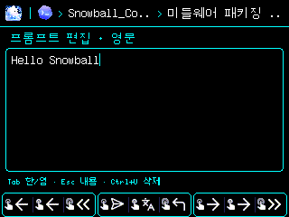 | 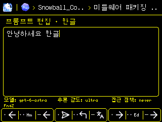 | 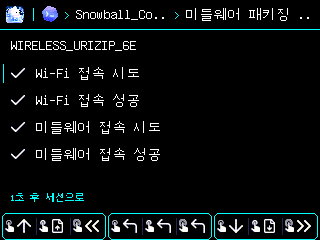 |

| Fn 컨트롤 | 모델 팝업 | Effort 팝업 | Access 팝업 |
| --- | --- | --- | --- |
| 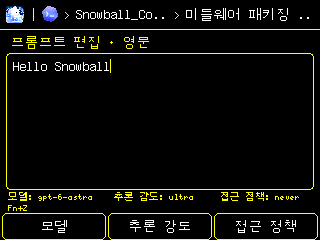 | 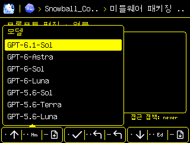 | 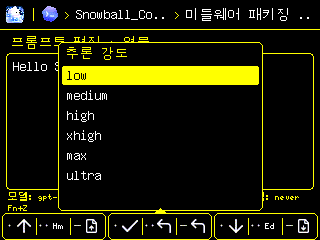 | 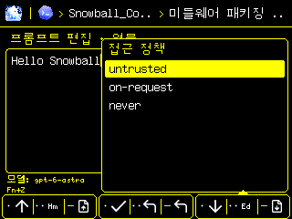 |

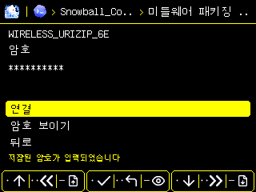

2026-10-04에 실제 M5Stack 펌웨어 0.2.2의 320×240 프레임버퍼에서 캡처했습니다. **표시 언어와 입력 언어를 독립적으로 선택하고 저장합니다.** 한글 화면에서 영문을 입력하거나 영문 화면에서 한글을 입력할 수 있습니다. 실제 세션 이름·경로·대화 내용은 원래 언어를 유지합니다. 암호 보이기를 켜도 진단 캡처에는 Wi-Fi 암호가 가려집니다.

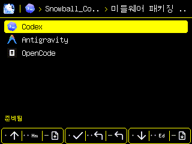

Breadcrumb는 메뉴, 하네스 원본 아이콘, 괄호 없는 프로젝트 이름, 세션 이름을 표시합니다. 하네스에 포커스를 주면 전체 이름이 나타납니다. 하단 Home / End는 **Hm / Ed**로 표시합니다. 나머지 동작에는 [Lucide](https://lucide.dev/) 아이콘을 사용하고, 누르기 표시는 같은 크기·기준선으로 맞춘 점 / 두 점 / 선입니다. 각각 한 번 / 두 번 / 길게 누르기입니다. 두 점은 원본 ellipsis의 가운데 원만 뺀 변형입니다. Lanczos 축소와 Floyd-Steinberg 디더링으로 RGB332 픽셀을 생성합니다. `assets/footer`에 원본·고정된 출처 URL·해시·라이선스가 있고, `firmware/footer_icons.h`에 생성된 픽셀이 있습니다. 기기에서 이미지를 다운로드하거나 변환하지 않습니다.

하네스 아이콘은 설치된 공식 OpenAI 확장의 Codex 앱 아이콘, [Google Antigravity 공식 배포 자료](https://antigravity.google/press), [OpenCode favicon](https://github.com/anomalyco/opencode/blob/dev/packages/ui/src/assets/favicon/favicon-96x96-v3.png)을 16×16 RGB332로 축소·디더링하고 RGB565로 전송합니다. 각 플러그인이 자신의 픽셀과 투명도 마스크를 정의합니다.

갤러리의 입력은 일회성 USB IME 진단으로 넣었으며 하네스에 프롬프트를 보내지 않았습니다. 실제 세션 대화는 갤러리에 넣지 않습니다. 이 캡처는 실제 렌더러를 확인하며, 위 실기 영상은 물리 버튼 탐색과 키보드 프롬프트 작성을 보여줍니다. 네이티브 하네스 응답 완료는 아직 검증하지 않았습니다.

아키텍처와 배포 검증은 [Snowball_Control/docs/ARCHITECTURE.md](https://github.com/fkiller/Snowball_Control/blob/main/docs/ARCHITECTURE.md) 한 곳에서 관리합니다. 0.2.2는 미들웨어의 `/v1/controller` API와 플러그인 표시 메타데이터를 사용합니다. 기기마다 세션·모델·Effort·Access·테마·스크롤을 복구하고, 표시와 입력 언어는 각각 기기에 저장합니다. 유효한 세션 선택이 없으면 실제 미들웨어에서 마지막으로 활동한 세션과 하네스·프로젝트를 엽니다. 이후 다른 기기의 활동이 명시적으로 선택한 세션을 바꾸지 않습니다. M5Stack 조작은 MK20나 웹 탭의 선택을 바꾸지 않습니다.

## 빌드와 업로드

Node ≥22.12, Python 3.12, CP210x 드라이버가 필요합니다. UART VID/PID만으로 제품을 식별하지 말고 실제 보드의 포트를 지정하세요. 최초 업로드 전 기존 플래시를 백업하세요.

```powershell
python -m venv .venv
.venv\Scripts\python -m pip install -r requirements.txt
.venv\Scripts\python -m platformio run
.venv\Scripts\python -m platformio run --target upload --upload-port COM7
```

기본 설정은 실제 확인한 16MB ESP32-D0WDQ6-V3용입니다. 4MB Core에서는 `board_upload.flash_size`를 `4MB`로 바꾸세요. 3MB 앱 파티션은 OTA를 지원하지 않으며 업데이트는 USB로 합니다.

## 실행

[공통 Windows 설치기](https://github.com/fkiller/Snowball_Middleware/blob/main/README.ko.md#snowball-한-번에-설치)의 `-Profile m5stack`은 설치된 미들웨어와 gateway를 숨김 네이티브 트레이로 실행하고 터미널로 반환합니다. 트레이에서 Web UI, 설정, 일시정지/재개, 재시작, 종료와 로그인 자동 시작을 제공합니다. 펌웨어 업로드 없이 설치를 반복할 때는 `-NoFlash`를 사용하며 USB/보드 검증과 등록 절차는 유지합니다. 교차 구성 검증과 남은 실물 확인은 [중앙 아키텍처](https://github.com/fkiller/Snowball_Control/blob/main/docs/ARCHITECTURE.ko.md#변경-영향과-문서-동기화)에 기록합니다.

기존 Snowball 미들웨어를 루프백 8765에서 실행하세요. 게이트웨이는 실제 세션 저널·목록·모델 카탈로그·명령 API를 사용합니다. 첫 버전은 기존 세션을 선택하며 새 세션 생성은 미들웨어에서 관리합니다.

```powershell
node scripts/gateway.mjs --serial COM7 --python .venv\Scripts\python.exe
# 독립 Wi-Fi 제어: PC의 실제 사설 LAN 주소 지정
node scripts/gateway.mjs --serial COM7 --python .venv\Scripts\python.exe --bind YOUR_PRIVATE_LAN_IP
# PC의 인바운드 방화벽에 막히는 경우 인증된 아웃바운드 TCP 사용
node scripts/gateway.mjs --bind YOUR_PRIVATE_LAN_IP --device PAIRED_DEVICE_IP
```

USB로 무작위 기기 등록 키를 전달합니다. 키는 PC의 `.local/pairing.key`와 기기의 NVS에 저장하며 `.local`은 소스 관리에 넣지 않습니다. Supervisor는 `127.0.0.1`에 남고, 게이트웨이는 지정한 사설 IP에 제한된 인증 프로토콜만 제공합니다. 검색은 UDP 47770, 서명된 HTTP는 TCP 47771입니다. PC에서 기기의 47774로 TCP를 연결하는 방법도 있으며, 신선한 기기 challenge로 PC를 인증한 뒤 서명된 프레임을 교환합니다. 이 방법은 PC의 인바운드 포트를 열 필요가 없습니다. DHCP 주소가 바뀌면 USB를 다시 연결하거나 `--device` 주소를 갱신하세요. 두 방법은 내용을 인증하지만 암호화하지 않으므로 신뢰하는 사설 LAN을 사용하세요. 검색은 실제 미들웨어가 응답할 때만 광고합니다. USB는 Wi-Fi 설정 없이 사용할 수 있으며, 최초 등록 후 Wi-Fi는 USB 없이 동작합니다.

## 조작

| 버튼 | 누르기 | 길게 / 반복 | 두 번 |
| --- | --- | --- | --- |
| A | ↑ / 왼쪽 | PgUp | Home |
| B | 선택 / 입력 | 하단에 표시되는 동작 | 하단에 표시되는 동작 |
| C | ↓ / 오른쪽 | PgDn | End |

세션 내용이 기본 화면입니다. Home으로 첫 줄에 간 뒤 ↑를 한 번 더 누르면 세션 Breadcrumb에 포커스가 갑니다. B로 현재 프로젝트의 세션 목록을 열며 현재 선택을 중앙에 배치합니다. 목록에서 Home 다음 ↑는 원래 Breadcrumb에 포커스를 주고 세션 내용으로 돌아갑니다. 설정 목록이나 하위 설정에서 맨 위를 넘으면 메뉴 아이콘에 포커스를 주면서 Content에는 메인 설정 목록을 유지합니다. 왼쪽 이동 순서는 **세션 → 프로젝트 → 하네스 → 머신 → 메뉴**입니다. 프로젝트와 하네스를 선택하면 실제 원천 목록이 열리고, 메뉴는 설정을 엽니다. 머신 목록은 이 루프백 게이트웨이가 관찰하는 실제 호스트 한 대를 표시합니다.

세션 내용에서 B는 입력 편집, 길게 B는 모델·Effort·새로고침, 두 번 B는 최신 내용으로 이동합니다. 마지막 내용에서 아래로 이동하거나 읽는 중 키보드 문자를 누르면 입력 편집으로 들어갑니다. 첫 문자는 입력에 포함됩니다. 목록에서 길게 B는 뒤로, 두 번 B는 세션 내용으로 돌아갑니다.

| 입력 편집 버튼 | 누르기 | 길게 / 반복 | 두 번 |
| --- | --- | --- | --- |
| A | 커서 왼쪽 | 계속 왼쪽 | Home |
| B | 실행 | 영문 ↔ 한글 | 세션 내용으로 |
| C | 커서 오른쪽 | 계속 오른쪽 | End |

텍스트 맨 앞에서 A/길게 A/키보드 Left는 초안·커서·읽던 위치를 보존하고 세션 내용으로 돌아갑니다. 두 번 A는 Home이며 편집에 남습니다. Tab은 한/영 전환, Esc는 뒤로, Backspace는 커서 앞 삭제, Ctrl+U는 로컬 초안 삭제입니다. UTF-8 문자를 쪼개지 않고 중간 삽입·삭제하며, Shift 조합은 된소리·쌍모음을 지원합니다. 읽기와 입력 중 WASD는 실제 문자로 입력됩니다. B나 Enter는 실제 제어 가능한 네이티브 세션에만 전송합니다. 이 기기의 명령 ID가 저널에 접수된 경우에만 초안을 지우며, 거부·전달 불명확 시 보존하고 자동 재전송하지 않습니다.

표시 언어와 입력 설정을 선택하면 메인 설정 메뉴로 돌아오며 각각 원래 행에 커서를 복구합니다. Left(문자 입력이 아닌 메뉴에서는 A), Esc, 뒤로는 부모 메뉴의 원래 선택 항목으로 돌아갑니다. AP/암호 화면과 모델·Effort 메뉴에도 적용됩니다. Breadcrumb의 Left 이동과 텍스트 입력의 A 문자는 유지됩니다. 설정의 **표시 언어**는 English / 한국어, **입력 설정**은 영문 / 한글 두벌식입니다. Tab이나 입력 편집의 길게 B는 입력만 바꿉니다. SSID와 암호에는 키보드 문자를 그대로 입력합니다. UI 문자열은 `firmware/i18n.h`와 `src/i18n.mjs`에 모았으며 프로토콜 키·경로·모델 ID·네이티브 내용은 번역하지 않습니다.

입력 편집에는 **Model·Effort·Access**의 현재 값과 **Fn+Z**를 표시합니다. 공장 FACES 펌웨어는 Fn과 Alt 단독 입력을 내부에서 처리하고 Core에 전달하지 않습니다. [공식 키보드 소스](https://github.com/m5stack/FACES-Firmware/blob/master/KeyBoard.ino)에서 Fn+Z는 `0xBA`를 전달하므로 이를 사용합니다. Alt의 누름·뗌 상태도 이 I²C 프로토콜로 전송되지 않습니다. Alt를 누르고 있는 동안 하단을 바꾸려면 키보드 ATmega328의 ISP 배선과 별도 펌웨어 변경이 필요합니다. 현재 Core USB UART는 ESP32만 업로드합니다. Fn+Z로 하단을 Model·Effort·Access로 바꾸고 A·B·C로 해당 위치에 연결된 팝업을 엽니다. A/C 이동, B 선택, 길게 A/C는 페이지 이동, 두 번은 Home/End입니다. Fn+Z 또는 Esc로 선택하지 않고 취소하면 초안·커서·기존 설정을 보존합니다.

모델과 모델별 Effort는 실제 카탈로그에서 가져옵니다. Access는 설치된 Codex CLI가 생성한 `TurnStartParams` 스키마의 승인 정책을 `/v1/harness/access`로 발견해 다음 실행에 전달합니다. 파일 시스템 샌드박스를 바꾸지 않으며 네이티브 요구사항에 따라 거부될 수 있습니다. 지원하는 실제 전송 구현이 없는 하네스에는 Access 선택지를 제공하지 않습니다. 선택 값은 기기별 상태로 보관하고 명시적으로 프롬프트를 실행할 때만 전달합니다.

세션 내용은 하단 버튼 바로 위까지 **12줄**을 표시합니다. 스크롤바는 실제 표시 중인 내용의 오프셋과 전체 줄 수로 크기·위치를 계산합니다. 이전의 제어 가능 여부·모델·상태 영역과 고정된 포커스 선을 제거했습니다.

## Wi-Fi와 미들웨어 연결

2.4GHz AP 검색, 숨김 SSID, 암호 입력, 연결, 명시적인 저장 정보 삭제를 지원합니다. 이전에 성공한 SSID를 선택하면 저장된 암호를 미리 채웁니다. 최대 여덟 개의 성공한 네트워크를 저장하고, 실패한 시도는 기존 암호를 덮어쓰지 않습니다. 기존 단일 SSID 설정도 해당 AP의 다음 연결 성공 때 이전됩니다. 저장 Wi-Fi 삭제는 모든 프로필을 지웁니다.

접속 화면은 **Wi-Fi 접속 시도 → Wi-Fi 성공 → 미들웨어 접속 시도 → 미들웨어 성공**을 실제 결과에 따라 표시합니다. Wi-Fi 성공에는 실제 연결과 IP 할당이, 미들웨어 성공에는 해당 기기와 컨트롤러에 대한 인증된 응답이 필요합니다. 현재 SSID와 키가 일치하는 연결은 재시도에서도 유지해 무선 드라이버를 불필요하게 재시작하지 않습니다. 성공 화면을 1초 보여준 뒤 세션으로 이동합니다. Wi-Fi 실패는 입력을 유지하고 가린 상태로 연결 화면에 돌아가고, 미들웨어 실패는 검색 메뉴로 돌아갑니다.

AP 검색은 사용자가 요청할 때만 실행하며 검색·결과·오류를 표시합니다. 검색 중 다시 누르면 진행 중인 작업을 유지하고 완료 전까지 기존 AP 목록을 보존합니다. 암호 화면에서는 미들웨어 폴링과 화면을 바꾸는 USB 검색을 막습니다. 암호는 기본적으로 숨기며 Tab/길게 B로 표시·숨김을 바꿉니다. 진단 캡처는 항상 암호를 가립니다. A+B+C를 2.5초 누르면 기기 등록을 초기화하며 USB로 다시 등록할 수 있습니다.

## 플러그인과 검증

`src/manifest.mjs`는 실제 워커 해시를 계산합니다. 워커는 `devices.list`와 `devices.render`만 선언하고 루프백 브로커를 사용합니다. 시리얼·LAN과 실제 미들웨어 명령은 호스트 게이트웨이가 처리합니다. 기존 PluginHost는 프로세스 격리를 제공하며 커널 파일 시스템 샌드박스가 아니므로 검토한 플러그인만 로드하세요.

```powershell
npm test
powershell -File scripts/test-ime.ps1
# 같은 포트를 쓰는 USB 게이트웨이는 먼저 종료
python scripts/device_qa.py --port COM7 --output artifacts/home.png
python scripts/check-wifi.py --port COM7 --rounds 3 --require-aps
python scripts/check-navigation.py --port COM7 --screens artifacts/navigation-screens
python scripts/check-editor.py --port COM7
python scripts/check-ui.py --port COM7 --screens artifacts/ui-screens
python scripts/check-settings.py --port COM7 --screens artifacts/localized-screens
python scripts/check-settings.py --port COM7 --connect
python scripts/check-settings.py --port COM7 --saved-password
python scripts/check-settings.py --port COM7 --wifi-failure
```

네이티브 테스트는 펌웨어에서 사용하는 IME·네비게이션·연결 헤더를 직접 컴파일합니다. 연결 테스트는 실제 관측에 따른 전이와 시간 제한을 확인하며 타이머로 성공을 만들지 않습니다. USB 검사는 실제 기기의 핸들러·프레임버퍼를 사용하고 하네스 프롬프트를 보내지 않습니다. 기존 초안이나 편집이 있으면 일회성 검사를 거부합니다. 화면 캡처만으로 사람의 물리 키 입력이나 하네스 작업 완료를 확인했다고 주장하지 않습니다.

`node scripts/check-live.mjs ABSOLUTE_MIDDLEWARE_DIRECTORY PRIVATE_GATEWAY_IP`는 실제 워커·코어 레지스트리·서명된 검색/요청/응답·동적 세션/모델/Effort·재전송 차단을 검사합니다. 기기의 로컬 선택을 바꾸지만 하네스 프롬프트는 보내지 않습니다.

하단 아이콘을 다시 생성하는 방법:

```powershell
npm install --prefix artifacts/icon-builder --no-audit --no-fund @resvg/resvg-js@2.6.2
$icons = Get-ChildItem assets/footer/*.svg | ForEach-Object { $_.FullName }
node scripts/rasterize-icons.mjs $icons
python scripts/build-footer-icons.py
```

SVG 렌더러는 빌드용이며 펌웨어·게이트웨이의 실행 의존성이 아닙니다. 라이선스는 Apache-2.0이고 M5Unified·M5GFX·ArduinoJson·ESP32 및 아이콘의 원래 라이선스를 유지합니다. 아이콘 고지는 `assets/footer/LICENSE-Lucide`와 루트 `LICENSE`를 참고하세요.
