<p align="center">
  
</p>

<h1 align="center">
  
  Snowball Device · M5Stack — Preview
</h1>

<p align="center"><strong>Original ESP32 Core + FACES keyboard firmware and device gateway</strong></p>

<p align="center">
  <a href="README.md">English</a> | <a href="README.ko.md">한국어</a>
</p>

<p align="center">
  <a href="LICENSE"></a>
  
  
  <a href="https://github.com/fkiller/Snowball_Middleware#one-shot-install"></a>
</p>

---

<a id="one-shot-install"></a>
## Install Snowball

**Snowball Middleware is the common installer and PC runtime.** Snowball Control owns the MK20 firmware, HUD and device tools; Snowball Device · M5Stack owns the ESP32 firmware and gateway. Web UI and M5Stack do not require a Control checkout. The three Snowball Harness repositories provide the Codex, Antigravity and OpenCode plugins, included in every profile.

Run **one** command in Windows PowerShell:

| Your setup | Installed together | Command |
| --- | --- | --- |
| MK20 | MK20 runtime + Middleware + all three harness plugins | `& ([scriptblock]::Create((irm 'https://raw.githubusercontent.com/fkiller/Snowball_Middleware/main/install.ps1'))) -Profile mk20` |
| M5Stack + FACES | M5Stack firmware/gateway + Middleware + all three harness plugins | `& ([scriptblock]::Create((irm 'https://raw.githubusercontent.com/fkiller/Snowball_Middleware/main/install.ps1'))) -Profile m5stack` |
| Web UI only | Middleware + all three harness plugins | `& ([scriptblock]::Create((irm 'https://raw.githubusercontent.com/fkiller/Snowball_Middleware/main/install.ps1'))) -Profile web` |

The installer prepares Node/Git (Python for hardware profiles), builds the selected repositories, verifies each isolated plugin's handshake, creates a **Start-Snowball.ps1** launcher and desktop shortcut, then opens **http://127.0.0.1:8765/** after the real API responds. Default location: `%LOCALAPPDATA%\Snowball`. The launcher runs the installed suite again without downloading dependencies.

Connect M5Stack by USB for first installation; flash size is detected, existing flash is backed up privately, and the actual firmware/FACES handshake is checked before enrollment. Connect MK20 to the same private LAN; its guided installer discovers ADB or walks through SD/Wi-Fi bootstrap and the physical QMK DFU step. Keep a full MK20 SD disk image before modifying it. Hardware access/USB reconnects and native harness sign-in require the owner; installed plugins do not fabricate a working provider when its native app is absent.

Options: `-InstallRoot PATH`, `-Serial COMx`, `-Bind PRIVATE_PC_IP`, `-Mk20Address DEVICE_IP:5555`, `-Port 8765`, `-NoStart`, `-NoFlash` (verify an already installed firmware). On ambiguous adapters or USB ports supply the matching option; installation stops on errors. The one-command bootstrap currently targets **Windows**; macOS developers with Node/Git can run `npm run setup -- --profile web` or `--profile m5stack` from a sibling checkout layout. Linux suite workers are not yet supported.

[Common architecture and repository ownership](https://github.com/fkiller/Snowball_Control/blob/main/docs/ARCHITECTURE.md)

[Control · MK20](https://github.com/fkiller/Snowball_Control) · [Middleware · Installer / Web UI](https://github.com/fkiller/Snowball_Middleware) · [Device · M5Stack](https://github.com/fkiller/Snowball_Device_M5Stack) · Harness: [Codex](https://github.com/fkiller/Snowball_Harness_Codex), [Antigravity](https://github.com/fkiller/Snowball_Harness_Antigravity), [OpenCode](https://github.com/fkiller/Snowball_Harness_OpenCode)

---

Native ESP32 firmware and a Snowball Protocol 1 hardware plugin for the original M5Stack Core / Gray and FACES QWERTY panel. The first release accepts English and Korean two-beolsik keyboard input; it does not capture audio or use a PC microphone.

## Physical hardware demo

The original M5Stack + FACES is shown navigating real session content, changing display language and composing a keyboard prompt. This is the owner's real device video, published on 2026-10-04.

<p align="center">
  <a href="assets/videos/m5stack_navigation_demo.mp4">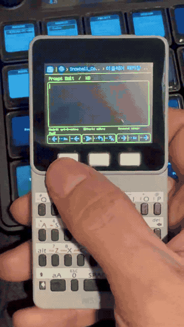</a><br>
  <em>24-second excerpt; full video: 1 minute 34 seconds.</em><br>
  <a href="assets/videos/m5stack_navigation_demo.mp4">▶ Full MP4 on GitHub</a> &nbsp;|&nbsp; <a href="https://x.com/fkiller/status/2106892916149158101?s=20">Original post on X</a>
</p>

## Device and running firmware

<a href="https://docs.m5stack.com/en/core/Faces_Kit"></a>

Hardware reference photo: © M5Stack, from the [official FACES Kit documentation](https://docs.m5stack.com/en/core/Faces_Kit). The photo shows the manufacturer's product, rather than this firmware running on our board; this release uses the QWERTY panel.

| Settings | Display language | Input settings |
| --- | --- | --- |
| 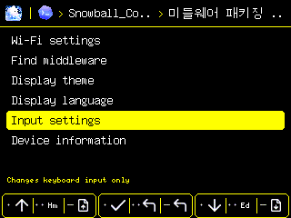 | 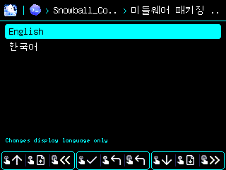 | 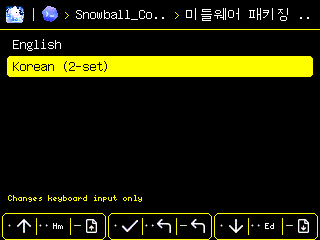 |

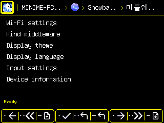

| English input | Korean input | Connection status |
| --- | --- | --- |
| 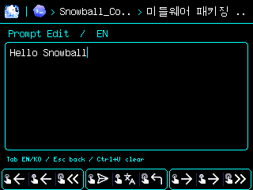 | 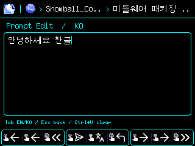 | 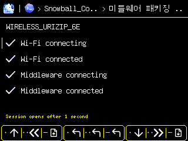 |

| Fn controls | Model popup | Effort popup | Access popup |
| --- | --- | --- | --- |
| 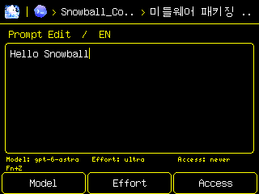 | 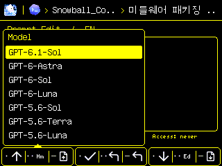 | 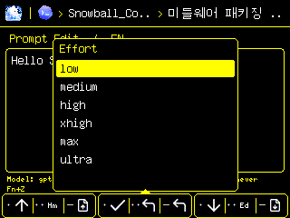 | 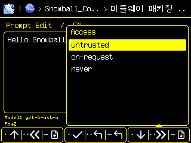 |

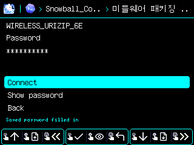

These native 320×240 framebuffers were captured from the real M5Stack 0.2.2 firmware on 2026-10-04. The [Korean documentation](README.ko.md) shows the same screens with Korean display text. **Display language and keyboard input are independent**: selecting English display keeps Korean input available, and selecting Korean display keeps English input available. Native session titles and content keep their original language. Diagnostic screenshots always mask Wi-Fi passwords, including when the LCD's Show option is enabled.

The breadcrumb uses the harness's original color icon, the project name without brackets, and the session title; focusing a harness reveals its full name. The footer uses **Hm / Ed** for Home / End, original [Lucide](https://lucide.dev/) action SVGs and aligned dot / two-dot / minus markers for single press / double press / hold. The two-dot marker omits the middle circle from the upstream ellipsis. SVG assets use Lanczos scaling and Floyd-Steinberg dithering for the RGB332 framebuffer. Source SVGs, pinned upstream URLs, hashes, and license notices are in `assets/footer`; generated pixels are in `firmware/footer_icons.h`. No icon downloads or conversions occur on the device.

Input text in the gallery was entered through the disposable USB IME diagnostic, which sends no harness prompt. Native transcripts are kept out of the gallery. Captures verify the actual firmware renderer; the real device video above also demonstrates physical button navigation and keyboard composition. A completed native harness turn remains unverified.

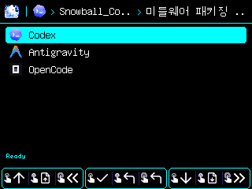

The plugin icons are reduced from the original Codex app icon in the installed official OpenAI extension, [Google Antigravity press asset](https://antigravity.google/press), and [OpenCode favicon](https://github.com/anomalyco/opencode/blob/dev/packages/ui/src/assets/favicon/favicon-96x96-v3.png). Lanczos scaling and dithering for the device's 8-bit RGB332 canvas (packed as RGB565) retain their colors and shapes at 16×16; each plugin owns its packed pixels and transparency mask.

The system architecture and deployment verification are maintained only in [Snowball_Control/docs/ARCHITECTURE.md](https://github.com/fkiller/Snowball_Control/blob/main/docs/ARCHITECTURE.md).

Version 0.2.2 requires the middleware's `/v1/controller` API and plugin presentation metadata. Each enrolled board restores its own session, model/effort/access choices, theme and scroll position; display and input languages persist separately on the board. The gateway checkpoints only this controller's display locale. With no valid saved session, it opens the real middleware's latest active session and derives its harness and project. Later activity on another controller does not replace an explicit selection. M5Stack navigation does not change MK20 or Supervisor tab selections.

## Build and upload

Requires Node >=22.12, Python 3.12, and the CP210x serial driver. Use an explicit serial port belonging to this board; a USB UART VID/PID alone does not identify the product. Back up existing flash before uploading.

```powershell
python -m venv .venv
.venv\Scripts\python -m pip install -r requirements.txt
.venv\Scripts\python -m platformio run
.venv\Scripts\python -m platformio run --target upload --upload-port COM7
```

The default profile targets the physically verified 16MB ESP32-D0WDQ6-V3 board. For a 4MB original Core, change `board_upload.flash_size` to `4MB` before flashing. The 3MB application partition does not support OTA; updates use USB.

## Run

The [common Windows installer](https://github.com/fkiller/Snowball_Middleware#install-snowball) with `-Profile m5stack` runs the installed middleware and gateway in a hidden native tray and returns to the shell. The tray provides Web UI, Settings, Pause/Resume, Restart, Quit and login startup. Use `-NoFlash` when repeating setup without uploading firmware; USB/board verification and enrollment remain part of that profile. Current cross-component verification and remaining native field checks are recorded in the [central architecture](https://github.com/fkiller/Snowball_Control/blob/main/docs/ARCHITECTURE.md#change-impact-and-documentation).

Start the existing Snowball middleware on loopback port 8765. The gateway uses its real session journal, session catalog, model catalog, and command API. Native session creation remains governed by the middleware; this release selects existing sessions.

```powershell
node scripts/gateway.mjs --serial COM7 --python .venv\Scripts\python.exe
# To enable standalone Wi-Fi control, explicitly bind your PC's private LAN IP:
node scripts/gateway.mjs --serial COM7 --python .venv\Scripts\python.exe --bind YOUR_PRIVATE_LAN_IP
# If the PC firewall blocks inbound discovery, use authenticated outbound TCP:
node scripts/gateway.mjs --bind YOUR_PRIVATE_LAN_IP --device PAIRED_DEVICE_IP
```

USB provisions a random device enrollment key. The key stays in `.local/pairing.key` on the PC and NVS on the device. Keep `.local` private and out of source control. The gateway exposes only a bounded authenticated device protocol on its selected private IP; the Supervisor remains on `127.0.0.1`. Discovery uses UDP 47770 and signed HTTP uses TCP 47771 when those inbound ports are allowed. The gateway can instead initiate outbound TCP to the paired device on 47774: a fresh device challenge authenticates the PC before any signed frames are exchanged. This route does not require opening PC inbound ports. The USB-reported device IP or explicit `--device` IP is remembered; DHCP address changes may require reconnecting USB or updating that IP. Both routes authenticate content but do not encrypt it; use a trusted private LAN. Discovery advertises only when the real middleware responds. USB is usable without configuring Wi-Fi; Wi-Fi operates without USB after initial enrollment.

## Keys

| Button | Click | Hold / repeat | Double |
| --- | --- | --- | --- |
| A | ↑ / left | PgUp | Home |
| B | Select / Compose | Context action shown in the footer | Context action shown in the footer |
| C | ↓ / right | PgDn | End |

Session content is the default screen. Home moves to its first line; another ↑ enters the session breadcrumb. B opens the current project's session list, centered on the current session. Home then ↑ returns to content with the session breadcrumb focused. From Settings or a settings selector, moving above the first item focuses the menu icon while keeping the main Settings list in Content. Move left through **session → project → harness → machine → menu**. Selecting project or harness opens its real source list; the menu opens Settings. The machine crumb appears only when focus reaches it or the menu icon. Lists use the same paging/Home/End controls. Machine discovery currently exposes the one real host observed by this loopback gateway.

In session content, B opens Prompt Edit, held B opens model/effort/refresh actions, and double B follows the latest lines. Moving down beyond the final content page or typing a keyboard key while reading also opens Prompt Edit; the first printable key becomes literal input. In lists, held B returns and double B opens session content.

| Prompt Edit button | Click | Hold / repeat | Double |
| --- | --- | --- | --- |
| A | Cursor left | Repeated left | Home |
| B | Execute | EN ↔ KO | Return to content |
| C | Cursor right | Repeated right | End |

At the start of the text, A/held A or keyboard Left returns to session content, preserving the draft, caret and reader position. Double A moves Home and stays in the editor.

Tab switches **EN ↔ KO**; Esc returns, Backspace deletes at the cursor, and Ctrl+U clears the local draft. UTF-8 cursor movement and insertion preserve whole Korean characters; committing active composition permits middle editing. Shifted Latin keys select doubled Korean consonants/vowels. Keyboard navigation letters remain literal input while reading or editing. B or Enter executes the draft only for a real controllable native session. The draft clears only after the journal admits this device's matching command ID. Rejected or ambiguous delivery retains it and never automatically resends.

Prompt Edit shows the selected **Model, Effort and Access**, plus **Fn+Z**. This stock FACES panel consumes bare Fn and Alt internally; [the original keyboard firmware](https://github.com/m5stack/FACES-Firmware/blob/master/KeyBoard.ino) emits `0xBA` for Fn+Z. Neither Alt-down nor Alt-up is transmitted by this stock I²C protocol. A held Alt layer, like bare Fn, requires updating the separate ATmega328 through its ISP wiring; the current Core USB UART programs the ESP32 only. Fn+Z opens the Model / Effort / Access footer; A, B or C opens a popup anchored to that button. A/C navigate, B selects, and Fn+Z again or Esc cancels without changing the choice or draft. Holding and double-clicking A/C retain paging and Home/End in the popup.

Models and their efforts come from the native catalog. Access currently changes the Codex next-turn approval policy, discovered from the installed CLI's `TurnStartParams` schema via `/v1/harness/access`; it does not change the native filesystem sandbox. The native app-server can still reject policies under its configured requirements. Providers without a supported dispatch adapter return no Access choices. Selection remains controller-local and is sent only with an explicit prompt execution.

Session content uses twelve visible lines, fills the area down to the footer, and has a proportional scrollbar based on the **displayed** content offset and actual total line count. The old controllability/model/status strip and fixed focus line are removed.

Wi-Fi settings scan 2.4GHz networks, accept passwords, reuse the saved password when selecting a previously joined SSID, and save only a successfully joined network, support hidden SSIDs, and offer explicit Forget. Hold all three buttons for 2.5 seconds to reset device enrollment; reconnect USB to enroll again.

AP scans run only when requested, with an explicit scanning/result/error status. Repeated Scan presses preserve the current scan, and the previous AP list remains visible until a new scan completes. Password entry pauses middleware polling and refuses USB scan requests that would change the screen. Passwords start hidden; **Tab or held B** shows/hides them. Diagnostic screenshots always mask passwords. Up to eight successfully joined networks are remembered; Forget removes them all. Existing single-network credentials are migrated when that network next connects. Failed attempts never overwrite saved credentials.

Connection progress shows **Wi-Fi attempt → Wi-Fi success → middleware attempt → middleware success**. Wi-Fi success requires real association and IP assignment; middleware success requires a verified authenticated response for this board/controller. A matching active SSID/key association is preserved during an explicit retry, avoiding a redundant driver restart. The success screen remains for one second, then opens session content. A Wi-Fi failure returns to the password/connection screen with the current input retained and hidden; a middleware failure opens the Find middleware menu for an explicit retry.

Display language and Input settings selection return to Settings with their original rows selected. Left (or A in non-text menus), Esc and Back restore the parent menu and selected item, including AP/password and action/model/effort menus. Top breadcrumb Left retains its breadcrumb navigation; text input keeps A as a letter. Settings includes **Display language** (English / 한국어) and **Input settings** (English / Korean 2-set). Tab or held B in Prompt Edit changes input only. Wi-Fi SSIDs/passwords always use literal keyboard characters. UI messages live in `firmware/i18n.h` and `src/i18n.mjs`; protocol keys, paths, native model IDs, and original native text are not translated.

## Plugin and verification

`src/manifest.mjs` computes the actual worker digest for the existing Snowball `PluginHost`. The worker declares only `devices.list` and `devices.render`, and uses a loopback broker. The host gateway owns serial/LAN transport and native middleware dispatch. The existing PluginHost provides process isolation, not a kernel filesystem sandbox; only reviewed plugins should be loaded.

```powershell
npm test
powershell -File scripts/test-ime.ps1
# Stop the gateway before opening the same serial port for diagnostics:
python scripts/device_qa.py --port COM7 --output artifacts/home.png
python scripts/device_qa.py --port COM7 --output artifacts/korean.png --korean --keys "dkssudgktpdy gksrmf"
# Real radio scan, repeat-request and AP-list retention checks (no credentials printed):
python scripts/check-wifi.py --port COM7 --rounds 3 --require-aps
# Explicit disposable local input QA; never connects or sends a harness prompt:
python scripts/check-wifi.py --port COM7 --require-aps --exercise-input
# Real firmware focus, native lists, paging and font-width checks; no prompt sent:
python scripts/check-navigation.py --port COM7 --screens artifacts/navigation-screens
# Optional disposable EN/KR draft captures; refuses an existing user draft:
python scripts/check-navigation.py --port COM7 --screens artifacts/navigation-screens --input-screens
# Explicit disposable real editor/cursor checks; refuses an existing draft:
python scripts/check-editor.py --port COM7
# Actual menu return, 12-line scroll, Fn cancellation and native popup captures:
python scripts/check-ui.py --port COM7 --screens artifacts/ui-screens
# Actual independent display/input settings and bilingual framebuffer captures:
python scripts/check-settings.py --port COM7 --screens artifacts/localized-screens
# Actual saved-network association, authenticated response, and one-second hold:
python scripts/check-settings.py --port COM7 --connect
# Actual saved AP/password prefill, without printing credentials:
python scripts/check-settings.py --port COM7 --saved-password
# Real radio attempt to an unregistered disposable SSID; restores saved network:
python scripts/check-settings.py --port COM7 --wifi-failure
```

The native IME/navigation/connection tests compile the exact headers used by firmware, including observed connection transitions and deadlines; no timer fabricates success. `device_qa.py` reads the real firmware state and its on-device rendered framebuffer; it does not dispatch a harness command. Screenshot evidence does not establish that a person physically pressed the buttons or that Wi-Fi credentials were entered correctly.

`node scripts/check-live.mjs ABSOLUTE_MIDDLEWARE_DIRECTORY PRIVATE_GATEWAY_IP` verifies the real hardware worker, core registry compatibility, signed discovery and request/response, dynamic session/model/effort reads, and replay rejection. It changes the device's local selection while checking menus, and sends **zero native harness prompts**.

License: Apache-2.0. M5Unified, M5GFX, ArduinoJson and ESP32 framework retain their upstream licenses.

To regenerate footer icons after an intentional source update:

```powershell
npm install --prefix artifacts/icon-builder --no-audit --no-fund @resvg/resvg-js@2.6.2
$icons = Get-ChildItem assets/footer/*.svg | ForEach-Object { $_.FullName }
node scripts/rasterize-icons.mjs $icons
python scripts/build-footer-icons.py
```

The renderer is a build-only tool; firmware and the gateway have no runtime icon dependency. Icon licenses are preserved in `assets/footer/LICENSE-Lucide`, in addition to the root Apache-2.0 license.
