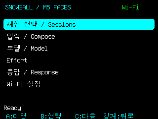
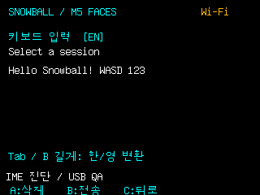
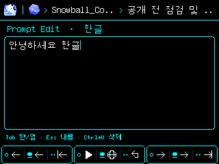

# Snowball Device — M5Stack + FACES

Native ESP32 firmware and a Snowball Protocol 1 hardware plugin for the original M5Stack Core / Gray and FACES QWERTY panel. The first release accepts English and Korean two-beolsik keyboard input; it does not capture audio or use a PC microphone.

## Device and running firmware

<a href="https://docs.m5stack.com/en/core/Faces_Kit"></a>

Hardware reference photo: © M5Stack, from the [official FACES Kit documentation](https://docs.m5stack.com/en/core/Faces_Kit). The photo shows the manufacturer's product, rather than this firmware running on our board; this release uses the QWERTY panel.

| Home / 홈 | English input / 영문 입력 | Korean input / 한글 입력 |
| --- | --- | --- |
|  |  |  |

These 320×240 images were captured from the real M5Stack firmware framebuffer on 2026-10-03. The home screen shows its observed Wi-Fi/middleware connection. The input captures show local English and Korean two-beolsik composition; **Tab or held B** switches languages. Their text was entered through the USB IME diagnostic, which sends no harness prompt. These captures verify device rendering, while physical keypresses and a completed native harness turn remain unverified.

The system architecture and deployment verification are maintained only in [Snowball_Control/docs/ARCHITECTURE.md](https://github.com/fkiller/Snowball_Control/blob/main/docs/ARCHITECTURE.md).

## Build and upload

Requires Node >=22.12, Python 3.12, and the CP210x serial driver. Use an explicit serial port belonging to this board; a USB UART VID/PID alone does not identify the product. Back up existing flash before uploading.

```powershell
python -m venv .venv
.venv\Scripts\python -m pip install -r requirements.txt
.venv\Scripts\python -m platformio run
.venv\Scripts\python -m platformio run --target upload --upload-port COM7
```

The default profile targets the physically verified 16MB ESP32-D0WDQ6-V3 board. For a 4MB original Core, change `board_upload.flash_size` to `4MB` before flashing. The 3MB application partition does not support OTA; updates use USB.

## Run

Start the existing Snowball middleware on loopback port 8765. The gateway uses its real session journal, session catalog, model catalog, and command API. Native session creation remains governed by the middleware; this release selects existing sessions.

```powershell
node scripts/gateway.mjs --serial COM7 --python .venv\Scripts\python.exe
# To enable standalone Wi-Fi control, explicitly bind your PC's private LAN IP:
node scripts/gateway.mjs --serial COM7 --python .venv\Scripts\python.exe --bind YOUR_PRIVATE_LAN_IP
# If the PC firewall blocks inbound discovery, use authenticated outbound TCP:
node scripts/gateway.mjs --bind YOUR_PRIVATE_LAN_IP --device PAIRED_DEVICE_IP
```

USB provisions a random device enrollment key. The key stays in `.local/pairing.key` on the PC and NVS on the device. Keep `.local` private and out of source control. The gateway exposes only a bounded authenticated device protocol on its selected private IP; the Supervisor remains on `127.0.0.1`. Discovery uses UDP 47770 and signed HTTP uses TCP 47771 when those inbound ports are allowed. The gateway can instead initiate outbound TCP to the paired device on 47774: a fresh device challenge authenticates the PC before any signed frames are exchanged. This route does not require opening PC inbound ports. The USB-reported device IP or explicit `--device` IP is remembered; DHCP address changes may require reconnecting USB or updating that IP. Both routes authenticate content but do not encrypt it; use a trusted private LAN. Discovery advertises only when the real middleware responds. USB is usable without configuring Wi-Fi; Wi-Fi operates without USB after initial enrollment.

## Keys

| Screen | A | B | C | FACES |
| --- | --- | --- | --- | --- |
| Menus | Previous | Select | Next | WASD / arrows navigate; Enter selects |
| Compose | Backspace | Review send | Back | Characters, including literal WASD; Enter reviews |
| Send confirmation | Return to draft | Send to selected native session | Back | Enter sends |
| Wi-Fi password | Backspace | Connect; hold to show/hide password | Back | ASCII SSID/password; Tab shows/hides; Backspace edits |

Hold a button in a menu to return home. In Compose, hold **B** or press **Tab** to switch **EN ↔ 한글**; hold A to return home; hold C to clear the draft. Shifted Latin keys select doubled Korean consonants/vowels. Text is UTF-8 throughout. A failed/unconfirmed send is never automatically resent.

Wi-Fi settings scan 2.4GHz networks, accept passwords, connect and save only a successfully joined network, support hidden SSIDs, and offer explicit Forget. Hold all three buttons for 2.5 seconds to reset device enrollment; reconnect USB to enroll again.

AP scans run only when requested, with an explicit scanning/result/error status. Repeated Scan presses preserve the current scan, and the previous AP list remains visible until a new scan completes. Password entry pauses middleware polling and refuses USB scan requests that would change the screen. Passwords start hidden; **Tab or held B** shows/hides them. Diagnostic screenshots always mask passwords.

## Plugin and verification

`src/manifest.mjs` computes the actual worker digest for the existing Snowball `PluginHost`. The worker declares only `devices.list` and `devices.render`, and uses a loopback broker. The host gateway owns serial/LAN transport and native middleware dispatch. The existing PluginHost provides process isolation, not a kernel filesystem sandbox; only reviewed plugins should be loaded.

```powershell
npm test
powershell -File scripts/test-ime.ps1
# Stop the gateway before opening the same serial port for diagnostics:
python scripts/device_qa.py --port COM7 --output artifacts/home.png
python scripts/device_qa.py --port COM7 --output artifacts/korean.png --korean --keys "dkssudgktpdy gksrmf"
# Real radio scan, repeat-request and AP-list retention checks (no credentials printed):
python scripts/check-wifi.py --port COM7 --rounds 3 --require-aps
# Explicit disposable local input QA; never connects or sends a harness prompt:
python scripts/check-wifi.py --port COM7 --require-aps --exercise-input
```

The native IME test compiles the exact header used by firmware. `device_qa.py` reads the real firmware state and its on-device rendered framebuffer; it does not dispatch a harness command. Screenshot evidence does not establish that a person physically pressed the buttons or that Wi-Fi credentials were entered correctly.

`node scripts/check-live.mjs ABSOLUTE_MIDDLEWARE_DIRECTORY PRIVATE_GATEWAY_IP` verifies the real hardware worker, core registry compatibility, signed discovery and request/response, dynamic session/model/effort reads, and replay rejection. It changes the device's local selection while checking menus, and sends **zero native harness prompts**.

License: Apache-2.0. M5Unified, M5GFX, ArduinoJson and ESP32 framework retain their upstream licenses.
